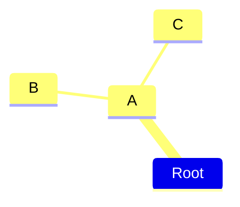

# 强调 `# 一级标题`
## 强调 `## 二级标题`
### 强调 `### 三级标题`

分隔线
---
`---`

1. 有序列表 `1. 有序列表`
2. 有序列表 `2. 有序列表`
- 无序列表 `- 无序列表`
- 无序列表 `- 无序列表`

<u>下划线</u>`<u>下划线</u>`
<mark>高亮</mark>`<mark>下划线</mark>`
$\overline{上划线}$ `$\overline{上划线}$`

$\Alpha$ `\Alpha`
$\alpha$ `\alpha`
$\Beta$ `\Beta`
$\beta$ `\beta`
$\gamma$ `\gamma`
$\theta$ `$\theta$`
$\varphi$ `$\varphi$`
$\psi$ `$\psi$`
$\xi$ `$\xi$`
$\lambda$ `$\lambda$`
$\mu$ `$\mu$`

$\forall$ `\forall`
$\exist$ `exist`

$\cdot$ `\dcot` 
$\leq$ `\leq`
$\geq$ `\geq`
$\pm$ `\pm`
$\neq$ `\neq`
$\vert$ `\vert`

$\rightarrow$ `\rightarrow`
$\Rightarrow$ `\Rightarrow`

$1\;1$ `1\;1`
$1\quad1$ `1\quad1`
$1\qquad1$ `1\qquad1`

$\in$ `\in`
$\ni$ `\ni`
$\subseteq$ `$\subseteq$`

$\cap$ `$\cap$`
$\cup$ `$\cup$`


$\underset{n\rightarrow0}{lim}$ `\underset{n\rightarrow0}{lim}`
$\sum\limits_{j=1}^{n}i$ `\sum\limits_{j=1}^{n}i`
$\int$ `\int`
$\sqrt[a]{b}$ `\sqrt[a]{b}`

$\partial$ `\partial`

---

$$
y=
\begin{cases}
-x,\quad x\leq 0\\
x, \quad x>0
\end{cases}
\tag{1}
$$

```
$$
y=
\begin{cases}
-x,\quad x\leq 0\\
x, \quad x>0
\end{cases}
\tag{1}
$$
```



```

\```mermaid
mindmap
    Root
        A
            B
            C
\```

```

<p style="color:red;">这是红色文本</p> 

```
<p style="color:red;">这是红色文本</p>
```